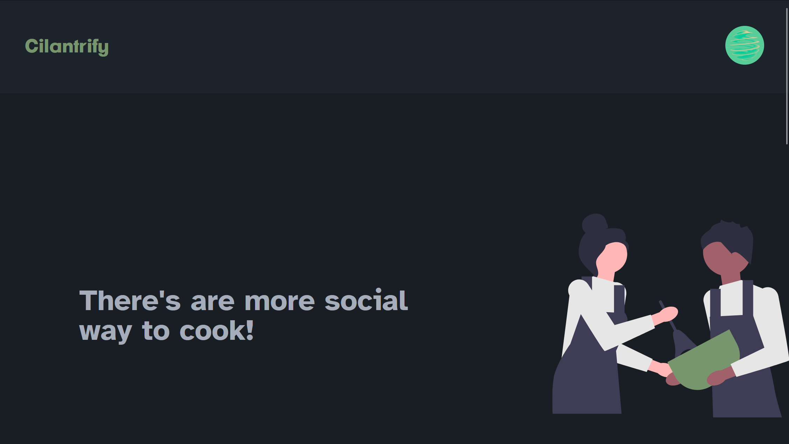
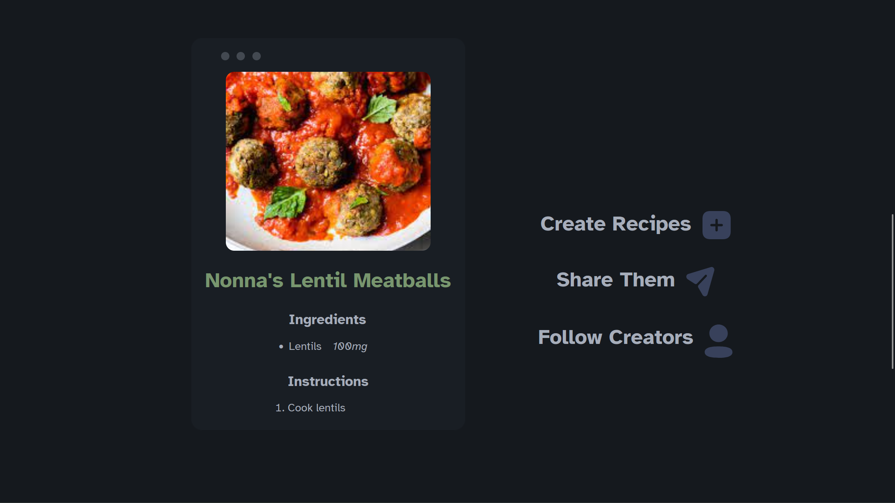
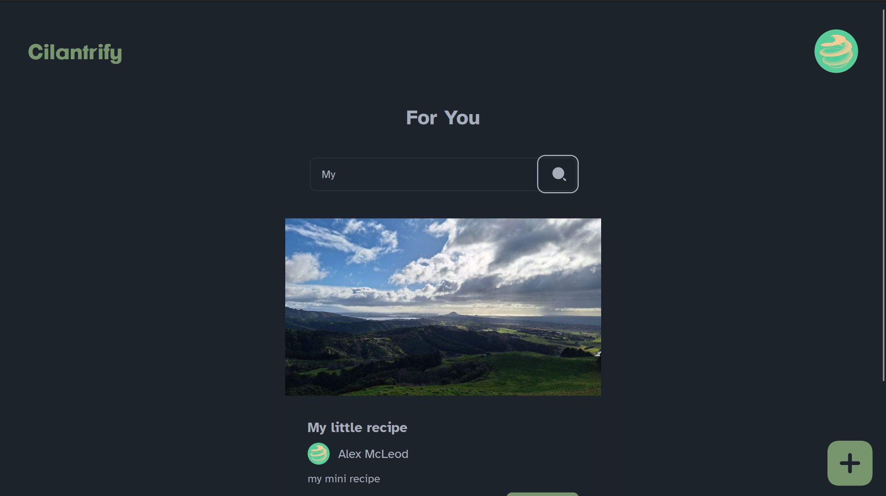

# Cilantrify
[](https://app.netlify.com/sites/cilantrify/deploys)

There's not really a way to share recipes online without sharing the link to someone's wordpress site covered in ads. It's difficult for everyday people to upload their recipes, save recipes they care about and follow people they are interested in. Cilantrify is a recipe sharing web app built with Solid, Typescript, Tailwind, DaisyUI, Rust, Axum, and SQL.





### Environment Variables

API:

- DATABASE_URL: For a Postgres database
- GOOGLE_CLIENT_SECRET: For Google OAuth
- GOOGLE_CLIENT_ID: For Google OAuth
- GOOGLE_REDIRECT_URL: For Google OAuth
- JWT_SECRET: Secret for verifying JWT's
- SMTP_PASS: Password for SMTP server
- SMTP_USER: Username for SMTP server
- SMTP_PORT: Port for SMPT server
- IMAGE_BB_API_KEY: API key for image storage solution ImageBB.
- UI_HOST: Address of the UI eg https://cilantrify.com

UI:

- VITE_API_URL: Address of the API eg https://api.cilantrify.com

## Usage

Requirements:

- Rust
- Node

In `/api` run `cargo run` to run.
In `/ui` run:

```bash
yarn install
yarn run dev
```
